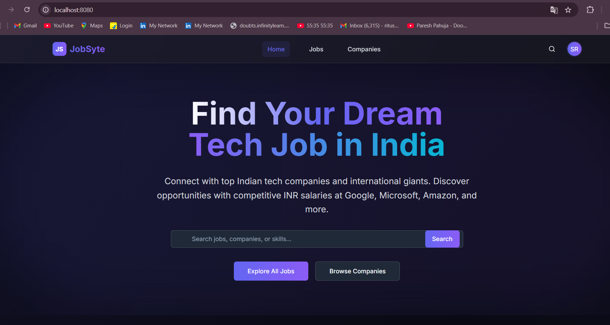
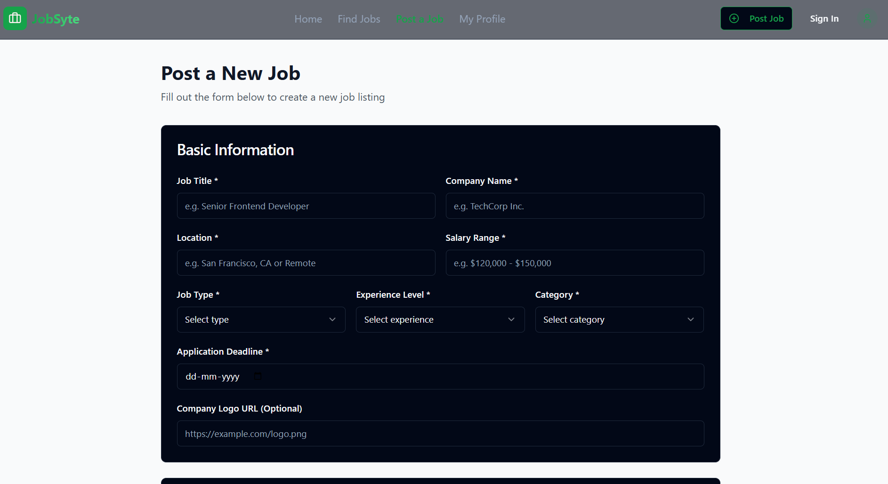
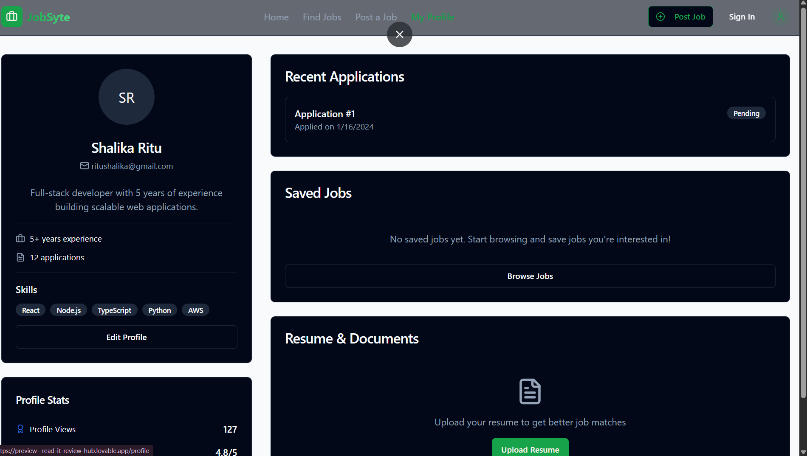

# 💼 Jobsyte

**Jobsyte** is a modern, full-stack **MERN (MongoDB, Express.js, React.js, Node.js)** based job portal web application. It bridges the gap between job seekers and employers by offering a clean, intuitive platform to post jobs, create profiles, and manage listings.

## 🚀 Features

- 🏠 **Homepage** – Welcome screen for users and job seekers.

- 📢 **Post Job** – Employers can post and manage job listings.

- 👤 **Profile Page** – Job seekers can manage their personal information and resumes.

- 🔍 **Job Listings** – Search, filter, and apply for jobs.

- 📁 **Asset Management** – All UI/UX screens are modularly placed in the `assets/` folder.

---

## 📁 Folder Structure

jobsyte/
├── assets/
│   ├── homepage/        # Homepage related components or UI
│   ├── postjob/         # Post job form/page
│   ├── profilepage/     # User profile management
│   └── ...other sections
├── client/              # React frontend
│   ├── src/
│   └── package.json
├── server/              # Express backend
│   ├── routes/
│   ├── controllers/
│   ├── models/
│   └── server.js
├── .env
├── package.json
└── README.md

## Tech Stack

Frontend
⚛️ React.js

🔄 Axios (API calls)

🎨 CSS / Tailwind (if used)

Backend
🌐 Node.js

🚂 Express.js

🛢️ MongoDB & Mongoose

## 👩‍💻 Author

**Shalika Ritu**  
📧 Email: shalikaritu@gmail.com  
🌐 GitHub: [github.com/shalikaritu](https://github.com/shalikaritu) 

## 📄 License

This project is licensed under the **MIT License**